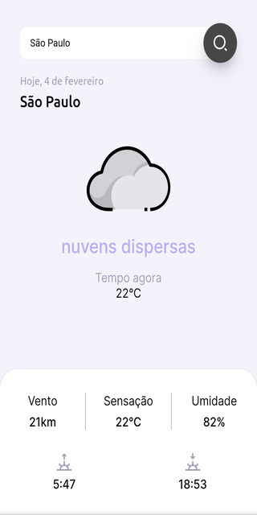

# SnapClima

🔗https://brenocuper.com/aula1/

Aplicação utilizando HTML, CSS e JAVASCRIPT com implementação de API de clima.

> API utilizada **open weather api**
>
> [open weather api]: https://openweathermap.org/api	" Site da Api"
>
> ```tex
> https://api.openweathermap.org/data/2.5/weather?lat={lat}&lon={lon}&appid={API key}
> 
> APIKey Eduardo-Quirino: 5441a76833c304a059fb6cd4f9f73638
> ```
>
> **Javascript**
>
> [x] Colocar descrição dentro de alt na weather-icon
>
> [x] Colocar aria-hidden = "true" na weather-icon
>
> [x] Voltar com os ... em todos os valores
>
> [x] Colocar no atributo content o valor maximum-scale=1
>
> [x] Observação sobre texto dentro de div

---


